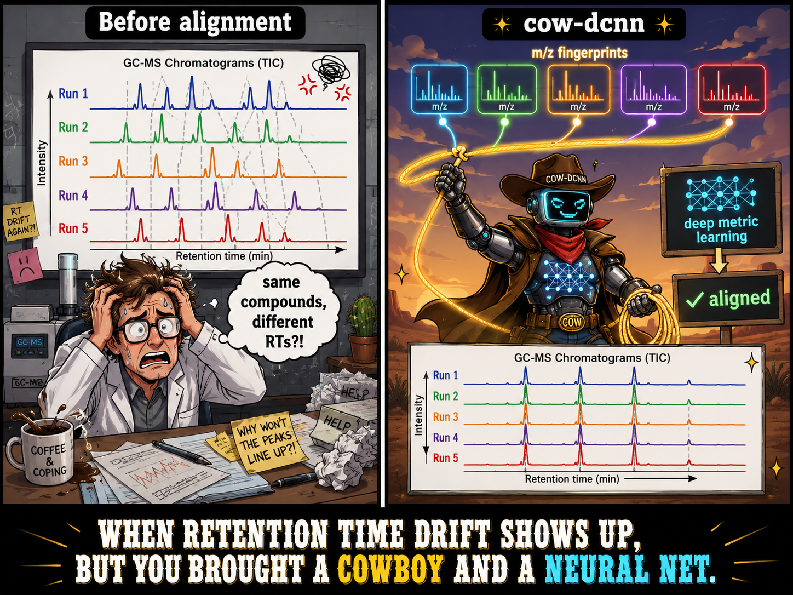

# cow-dcnn



Can a learned EI-MS encoder improve cross-study GC-MS chromatogram alignment between
datasets from completely different biological matrices?

COW (Correlation Optimised Warping) guided by EI-MS compound identities rather than
raw TIC signal. Each chromatogram peak carries a 1000-dim m/z fingerprint; peaks are
matched across runs using cosine similarity (optionally lifted into a learned embedding
space) and a piecewise-linear warp is fit through the matched anchor pairs.

**Short answer:** yes. A cross-study SimCLR encoder trained on matched peaks from
wheat and rice GC-MS datasets achieves a mean Pearson TIC correlation of **0.361**
across 3,160 wheat↔rice pairs — a **+0.081** improvement over the unaligned baseline
(0.280), and well ahead of raw cosine similarity (+0.008) or the within-study drift
encoder (+0.040).

## Method

### Alignment pipeline

1. **Peak detection** — find TIC peaks in each sample (top-N by height, min separation 5 bins)
2. **M/z fingerprinting** — extract the L2-normalised m/z spectrum at each peak
3. **Peak matching** — cosine similarity + time-window constraint + Hungarian one-to-one matching
4. **RANSAC filtering** — remove geometric outliers from matched anchor pairs
5. **Warp fitting** — piecewise-linear interpolation through inlier anchors, with monotonicity enforcement
6. **TIC resampling** — resample the query TIC onto the reference time axis

### Encoder pretraining

Three peak-matching strategies are compared as drop-in replacements for raw cosine
similarity in step 3:

**Raw cosine**: direct m/z spectrum cosine similarity; no learned embedding.

**Drift encoder** (`pretrain_drift.py`): SimCLR contrastive pretraining where positive
pairs are matched peak spectra from *different* runs of the *same* dataset. Captures
within-study inter-run spectral variation. Initialised from a MoNA SimCLR checkpoint.

**Cross-study encoder** (`pretrain_cross_study.py`): SimCLR contrastive pretraining
where positive pairs are matched peak spectra from *different* datasets (wheat and rice).
Positive pairs are peaks matched by RANSAC-filtered COW alignment; negatives are
unmatched peaks from different samples. This teaches the encoder to be invariant to
the larger spectral shifts that arise when the biological matrix changes entirely.

## Data setup

Raw data is excluded from version control (`data/**` in `.gitignore`).
Run the scripts below in order to reproduce the datasets from scratch.

### Option A — copy from an existing chroma-dcnn checkout (fastest)

If you already have a local `chroma-dcnn` repo with processed data:

```bash
python scripts/01_download_data.py --from-chroma-dcnn /path/to/chroma-dcnn
```

This copies all processed `.npz` chromatogram files directly, skipping raw
download and CDF parsing.

### Option B — download + preprocess from public sources

**MTBLS288** (rice grain GC-MS, MetaboLights, ~5 GB raw):

```bash
python scripts/02_preprocess_mtbls288.py          # download + preprocess
python scripts/02_preprocess_mtbls288.py --workers 8  # parallel download
```

**MTBLS21** (wheat grain GC-MS under CO₂ treatments, MetaboLights):

```bash
python scripts/05_preprocess_mtbls21.py
```

**Pretraining spectra** (MoNA + MassBank EU EI-MS, ~200 MB download):

```bash
python scripts/04_download_pretrain_data.py          # MoNA + MassBank
python scripts/04_download_pretrain_data.py --mona-only  # MoNA only
```

### Expected layout after preprocessing

```
data/
  mtbls21/
    chroma/       {sample_id}.npz  [200, 1000] float32   (wheat, 40 samples)
  mtbls288/
    chroma/       {stem}.npz       [200, 1000] float32   (rice,  79 samples)
    X.npy         [80, 1000]  sum spectra
    y.npy         [80]        cultivar labels (0–3)
    groups.txt    biological replicate IDs
    sample_ids.txt
  pretraining/
    spectra.h5    [N, 1000]  sqrt+L2 normalised EI-MS spectra
```

## Training

```bash
# Within-study drift encoder
python scripts/pretrain_drift.py

# Cross-study encoder (wheat ↔ rice positive pairs)
python scripts/pretrain_cross_study.py
```

Scripts auto-select CUDA → MPS → CPU. Checkpoints are saved to `checkpoints/` (excluded from git).

## Evaluation

```bash
python scripts/14_cross_study.py
```

Evaluates all methods on the cross-study task: 3,160 wheat (MTBLS21, 40 samples) ×
rice (MTBLS288, 79 samples) pairs. Drift window: 20 min. Precision cutoff: m/z cosine ≥ 0.7.

## Results

### Cross-study alignment (wheat MTBLS21 × rice MTBLS288, 3,160 pairs)

| Method | TIC r | Δ unaligned | Precision | Anchors |
|---|---|---|---|---|
| Unaligned | 0.280 | — | — | — |
| Raw cosine | 0.288 | +0.008 | 1.000 | 1.6 |
| Drift encoder | 0.320 | +0.040 | 0.967 | 2.2 |
| **Cross-study encoder** | **0.361** | **+0.081** | 0.959 | 2.1 |

- **TIC r**: mean Pearson correlation of aligned TICs across all wheat↔rice pairs
- **Precision**: fraction of matched peak pairs with m/z cosine ≥ 0.7 (same-compound proxy)
- **Anchors**: mean RANSAC-inlier anchor pairs used per alignment

**Key findings:**

- *Cross-study pretraining is the key.* The cross-study encoder (0.361) substantially
  outperforms both raw cosine (0.288) and the drift encoder trained only on within-study
  pairs (0.320). Exposure to genuine wheat↔rice spectral variation during pretraining
  allows the model to find shared metabolites across completely different matrices.

- *Raw cosine yields almost no improvement.* With only 1.6 RANSAC-inlier anchors per
  pair on average, raw cosine matching struggles to find enough reliable shared
  compounds between wheat and rice for the COW warp to be effective (+0.008).

- *Learned encoders find more anchors with acceptable precision.* Both learned
  encoders increase mean anchors to ~2.1–2.2 while maintaining high precision
  (≥0.96), giving COW enough anchor pairs to fit a meaningful warp.

- *The cross-study encoder trades a small precision drop for a large alignment gain.*
  Precision falls from 1.000 (raw cosine) to 0.959 (cross-study encoder), but TIC r
  rises by +0.081 — the encoder correctly retrieves more shared-compound pairs that
  raw cosine similarity missed.

**Limitations.** Only two datasets are evaluated; results may vary with different
biological matrices or instrument platforms. Precision is a proxy (m/z cosine ≥ 0.7)
rather than confirmed compound identity. The cross-study encoder was pretrained on the
same two datasets used for evaluation, so generalisation to unseen study pairs is untested.

## Exploration

See `notebooks/01_explore_alignment.ipynb` for the full alignment pipeline:
peak detection, m/z fingerprint extraction, Hungarian matching, piecewise-linear
warping, FAME library identification against MoNA, and encoder comparisons.
